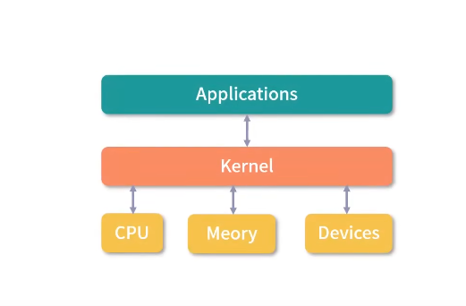
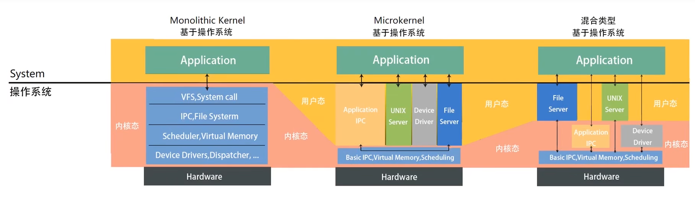
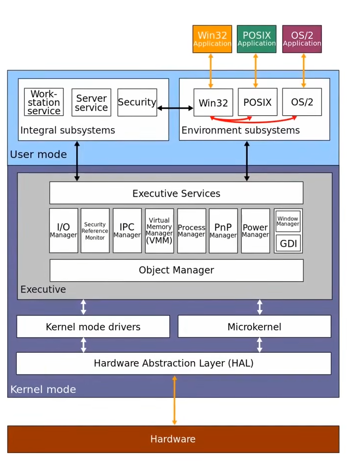

## 1、Linux 内核与 Windows 内核有什么区别?

答：Windows 有两个内核，最新的是 NT 内核，目前主流的 Windows 产品都是 NT 内核，NT 内核与 Linux 内核非常相似。但是 NT 内核是混合行内核，Linux 内核是宏内核。

其他差异：

* Linux 是一个开源的内核

* 它们支持的可执行文件格式不同

* 用到的虚拟化技术不同

补充：

内核是操作系统中应用连接硬件设备的桥梁。至少具备以下四种基本能力：

* 管理进程、线程

* 管理内存

* 连接硬件设备

* 提供系统调用

操作系统分层：

 

Linux 的设计：

* Multitask and SMP(Symmetric multiprocessing)

* ELF(Executable and Linkable Format)

* Monolithic Kernel (宏内核)：有很多程序会打包在内核中

 

Windows 的设计：

 

* PE (可移植执行文件)：.exe、.dll、.sys

